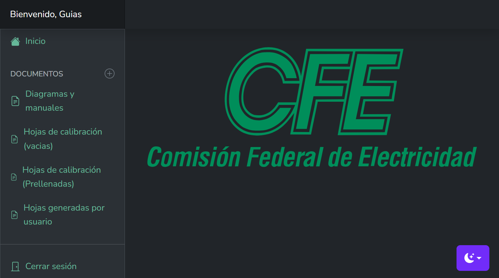

::: danger
🚧 Sitio en construcción 🚧

Esta guía está en desarrollo. La información está incompleta y se irán agregando más secciones y contenido próximamente.
:::
# Un Vistazo a la Pantalla Principal

Al iniciar sesión, esta es la pantalla que te recibirá. Funciona como tu centro de operaciones. A continuación, te explicaremos cada elemento del menú para que sepas exactamente a dónde ir. 
El menú lateral a la izquierda es tu principal herramienta de navegación. Veamos qué hace cada opción:

## 1. Inicio

Este es el botón que te traerá siempre de vuelta a esta pantalla de bienvenida principal.

## Sección 'DOCUMENTOS'

Esta es la sección más importante de la aplicación, donde trabajarás la mayor parte del tiempo. Contiene las siguientes opciones:

### 2. Diagramas y manuales

Aquí podrás consultar y visualizar los diagramas y manuales de referencia que necesites para tu trabajo.

### 3. Hojas de calibración (vacías)

Utiliza esta opción cuando necesites generar un nuevo documento o formato desde cero, sin ninguna información prellenada.

### 4. Hojas de calibración (Prellenadas)

Esta es la opción ideal si quieres generar un documento a partir de una plantilla que ya incluye datos específicos, ahorrándote tiempo.

### 5. Hojas generadas por usuario

En esta sección encontrarás una lista de todos los documentos que tú has creado previamente. Podrás verlos, editarlos o enviarlos por correo.

## 6. Cerrar sesion
 
Usa este botón cuando termines tu trabajo para cerrar sesion y salir de la aplicación. 

## 7. Cambiar Apariencia (Extra)

El ícono de luna/sol en la esquina inferior derecha te permite cambiar entre el modo oscuro y el modo claro de la aplicación, ¡usa el que te sea más cómodo!