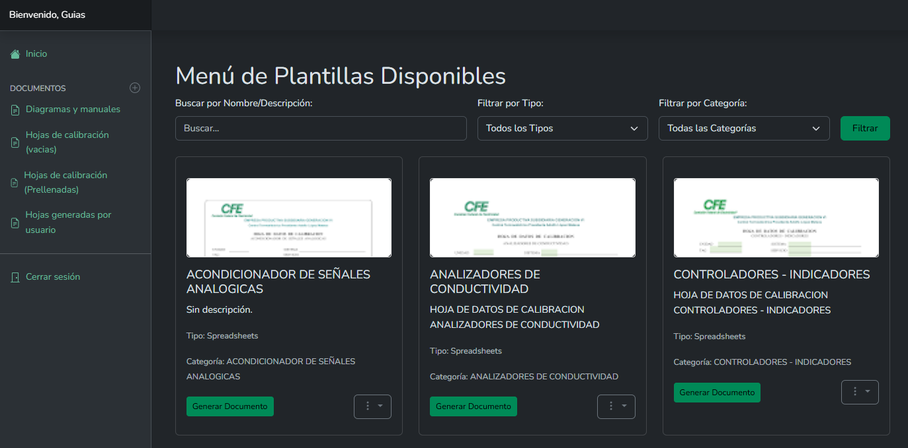
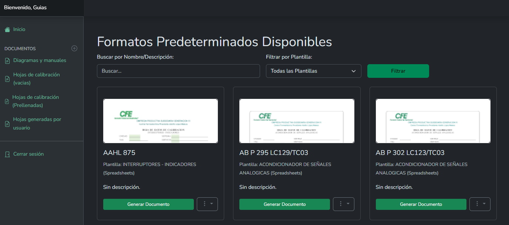

::: danger
🚧 Sitio en construcción 🚧

Esta guía está en desarrollo. La información está incompleta y se irán agregando más secciones y contenido próximamente.
:::
# Cómo Generar una Hoja de Calibración

Ahora que ya conoces el panel principal, es momento de realizar la tarea más importante: generar una Hoja de Calibración. El sistema te da dos puntos de partida, cada uno diseñado para una situación diferente:

* **Desde una Plantilla Vacía:** Esto te permite elegir la estructura o el "molde" de un documento. Es la opción perfecta cuando necesitas introducir todos los datos manualmente.

* **Desde un Formato Predeterminado (Prellenado):** Esto te permite partir de un documento que ya contiene información específica de un equipo o trabajo recurrente. Es la opción más rápida para calibraciones periódicas del mismo equipo.

## Desde una Plantilla Vacía

Usa este método cuando necesites empezar con el formato correcto, pero sin datos previos.

1. Accede al Menú de Plantillas

En el menú lateral izquierdo, haz clic en Hojas de calibración (vacías).

Se te mostrará la galería de "Menú de Plantillas Disponibles". Estas son las plantillas o "moldes" de los documentos que puedes crear. 

2. Encuentra y Elige la Plantilla Correcta

Usa las herramientas en la parte superior para encontrar la estructura que necesitas:

Buscar por Nombre/Descripción: Escribe una palabra clave para encontrar rápidamente la plantilla.

Filtrar por Tipo o Categoría: Selecciona una opción en los menús desplegables para acotar tu búsqueda.

3. Genera el Formulario

Una vez que encuentres la plantilla, haz clic en el botón verde Generar Documento.

Opcional: En el menú de tres puntos (...) también puedes Ver PDF para previsualizar el formato o Descargar XLSX si lo necesitas en Excel.

4. Rellena la Información

Al hacer clic en Generar Documento, se te llevará a un formulario completamente vacío.

Rellena todos los campos con la información de la calibración que estás realizando.

5. Guarda tu Documento

Cuando termines, haz clic en "Guardar" o "Crear". ¡Listo! Tu nuevo documento aparecerá en la sección de Hojas generadas por usuario.

## Desde un Formato Predeterminado (Prellenado)

Usa este método para ahorrar tiempo en trabajos recurrentes.

1. Accede a los Formatos Predeterminados

En el menú lateral izquierdo, haz clic en Hojas de calibración (Prellenadas).

Se te mostrará la galería de "Formatos Predeterminados Disponibles". Cada uno representa un trabajo o equipo específico con datos ya cargados.

2. Encuentra el Formato que Necesitas

Usa la barra de "Buscar por Nombre/Descripción" o el filtro de "Plantilla" para localizar rápidamente el formato del equipo que vas a calibrar.

3. Genera el Documento Prellenado

Haz clic en el botón verde Generar Documento del formato que elegiste.

4. Verifica y Completa la Información

Tu trabajo es simplemente verificar que los datos base son correctos y completar la información que falta (como las mediciones de hoy, la fecha, etc.).

5. Guarda tu Documento

Cuando termines, haz clic en "Guardar" o "Crear". Tu nuevo documento, generado en tiempo récord, aparecerá en la sección de Hojas generadas por usuario.

