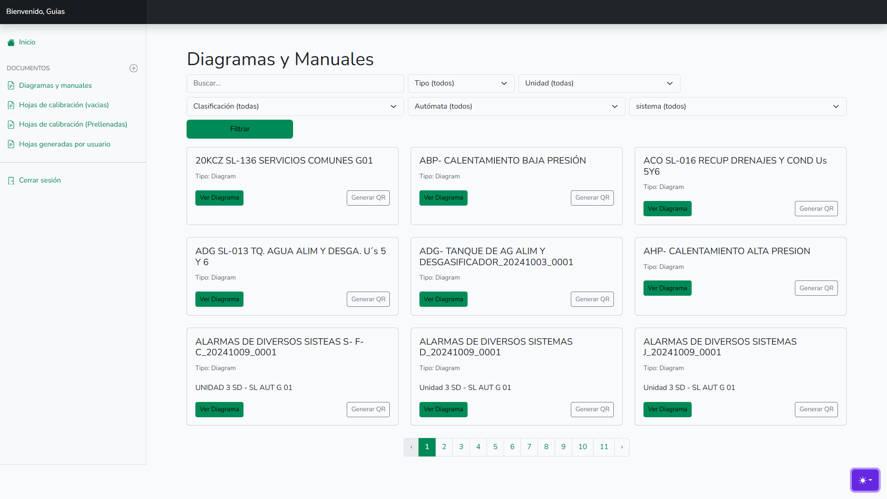
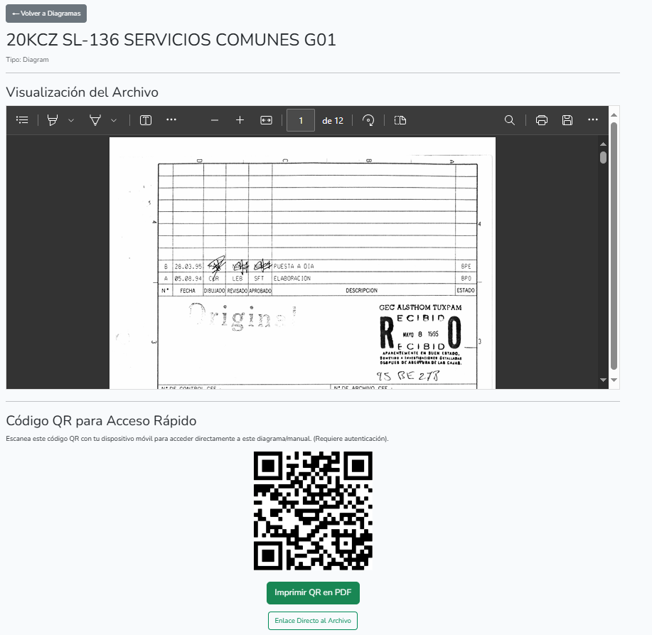

::: danger
🚧 Sitio en construcción 🚧

Esta guía está en desarrollo. La información está incompleta y se irán agregando más secciones y contenido próximamente.
:::
# Cómo Consultar Diagramas y Generar Códigos QR

Esta sección de la aplicación funciona como tu biblioteca digital centralizada. Aquí puedes buscar, consultar y visualizar todos los diagramas y manuales técnicos importantes. Además, aprenderás a generar Códigos QR, una herramienta muy útil para acceder a estos documentos directamente desde el campo.

## Búsqueda y Visualización de Diagramas

1. Accede a la Biblioteca

En el menú lateral izquierdo, haz clic en la opción Diagramas y manuales.

Verás una galería con todos los archivos disponibles, junto con un panel de búsqueda en la parte superior.

2. Encuentra el Archivo que Necesitas

Puedes encontrar un archivo de varias maneras:

Búsqueda Directa: Escribe el nombre o una palabra clave en la barra de "Buscar".

Filtros: Utiliza los menús desplegables (Tipo, Unidad, Clasificación, etc.) para acotar los resultados y encontrar exactamente lo que buscas. Haz clic en el botón verde "Filtrar" para aplicar tu selección.

3. Visualiza el Archivo

Una vez que localices el diagrama o manual, haz clic en el botón verde Ver Diagrama.

## La Pantalla de Visualización y el Código QR

Al ver un diagrama, accederás a una pantalla con varias herramientas útiles.

1. El Visor de Documentos

En la parte superior, tienes un visor de PDF integrado. Usa los controles para:

* Navegar entre las páginas.

* Aumentar o disminuir el zoom.

* Imprimir o descargar el archivo directamente a tu computadora.

2. El Código QR para Acceso Rápido

¿Para qué sirve? El código QR es una herramienta poderosa para el trabajo en campo. La idea es que puedas imprimir este código, pegarlo en un equipo físico (un motor, un panel de control, etc.) y cualquier persona con un teléfono o tablet pueda escanearlo para abrir instantáneamente el diagrama digital correspondiente.

Desde esta pantalla puedes hacer dos cosas:

* Imprimir QR en PDF: Prepara un documento limpio para imprimir la etiqueta QR.

* Enlace Directo al Archivo: Te da la URL directa al documento digital.