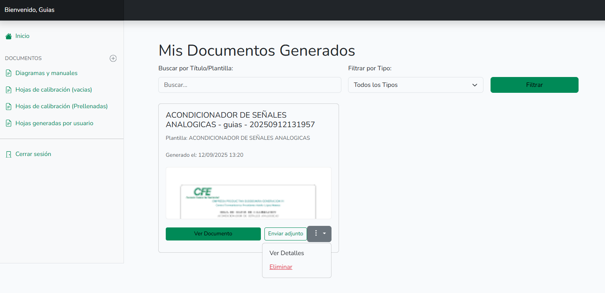
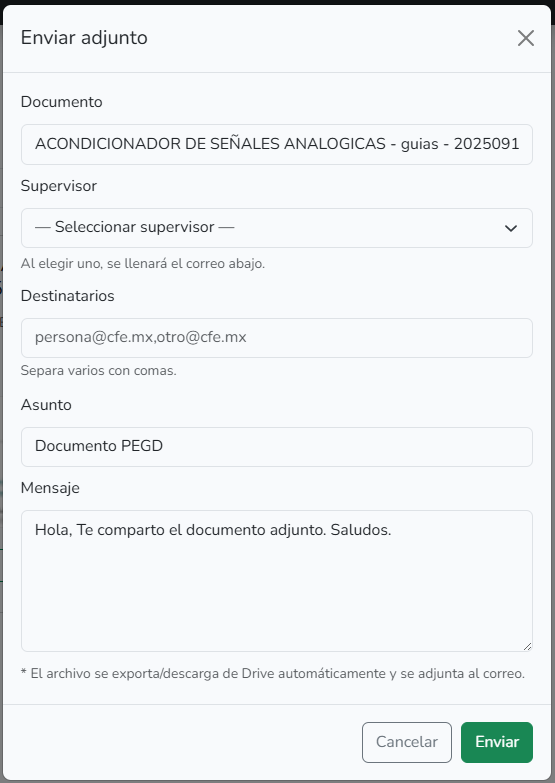

::: danger
🚧 Sitio en construcción 🚧

Esta guía está en desarrollo. La información está incompleta y se irán agregando más secciones y contenido próximamente.
:::

# Cómo Administrar y Compartir tus Documentos Generados

Cada vez que generas un documento, ya sea desde cero o a partir de una plantilla, se guarda en tu archivo personal. Esta sección es tu propia biblioteca, donde puedes encontrar, visualizar, compartir y eliminar todo el trabajo que has realizado. En esta guía, te mostraremos cómo administrar tus documentos

## Accediendo y Buscando en tu Archivo

1. Entra a tus Documentos

En el menú lateral izquierdo, haz clic en la última opción de la sección 'DOCUMENTOS': Hojas generadas por usuario.

Verás una lista con todos los documentos que has creado, mostrando el más reciente primero.

2. Busca un Documento Específico

Si tienes muchos documentos, puedes usar los filtros en la parte superior para encontrar uno rápidamente:

* **Buscar por Título/Plantilla:** Escribe una palabra clave del nombre del documento que buscas.

* **Filtrar por Tipo:** Usa el menú desplegable si quieres ver solo un tipo específico de documento.

Haz clic en el botón verde "Filtrar" para aplicar tu búsqueda.

## Acciones Disponibles para Cada Documento

Cada documento en tu lista tiene una serie de acciones que puedes realizar.

1. Ver el Documento

Para visualizar un archivo, simplemente haz clic en el botón verde Ver Documento.

Esto abrirá el documento en una nueva pestaña de tu navegador directamente en Google Docs/sheets, para que puedas revisarlo en detalle.

2. Enviar el Documento por Correo (Adjunto)

Esta es la forma más sencilla de compartir tu trabajo con supervisores o colegas.

Paso 1: Haz clic en el botón Enviar adjunto.

Paso 2: Se abrirá una ventana emergente (un modal) con un formulario de correo.

Paso 3: Rellena la información del correo:

Supervisor: Haz clic en el menú desplegable y selecciona a tu supervisor de la lista. Al hacerlo, su correo electrónico aparecerá automáticamente en el campo de abajo.

Destinatarios: Si necesitas enviar el documento a más personas, puedes añadir sus correos electrónicos en este campo, separados por comas.

Asunto y Mensaje: Estos campos ya vienen con un texto predeterminado para tu comodidad, pero puedes editarlos libremente si lo necesitas.

Paso 4: Haz clic en el botón verde Enviar. El sistema se encargará de adjuntar el archivo y enviarlo por ti.

## Eliminar un Documento

Si ya no necesitas un documento y quieres eliminarlo de tu lista:

Paso 1: Haz clic en el menú de opciones (el botón con los tres puntos ...).

Paso 2: Selecciona la opción Eliminar del menú que aparece.

Paso 3: El sistema te pedirá que confirmes si realmente deseas eliminar el documento.