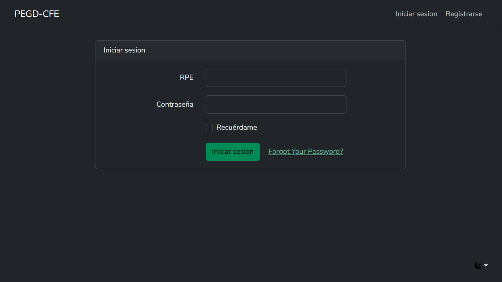
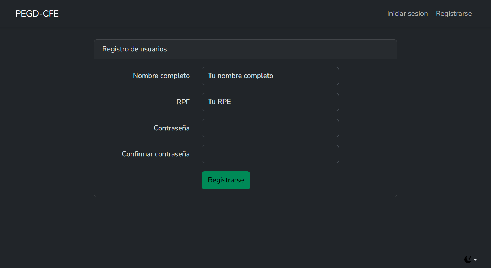
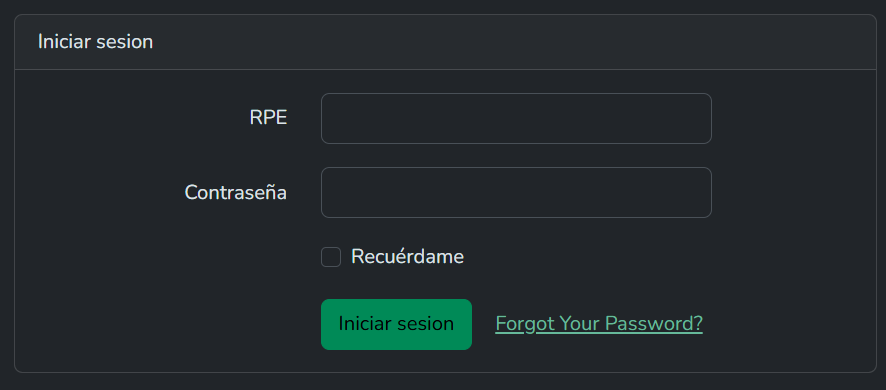

::: danger
🚧 Sitio en construcción 🚧

Esta guía está en desarrollo. La información está incompleta y se irán agregando más secciones y contenido próximamente.
:::
# Creando tu Cuenta y Primer Inicio de Sesión

Para poder utilizar el sistema PEGD, el primer paso es crear una cuenta personal. Esta cuenta deberá ser aprobada por un administrador antes de que puedas acceder. En esta guía te mostraremos cómo registrarte y cómo iniciar sesión por primera vez.

## Cómo Registrar tu Cuenta

1. Accede a la dirección web de la aplicación. Verás la pantalla de bienvenida.
    

3. Haz clic en el enlace o botón que dice 'Registrarse'.
4. Rellena el formulario de registro con la información que se te solicita: Nombre completo, RPE, y Contraseña.
    
5. Una vez que envíes el formulario, tu cuenta quedará pendiente de aprobación. Un administrador del sistema debe activarla manualmente.

## Cómo Iniciar Sesión

1. Una vez que hayas recibido la confirmación de que tu cuenta ha sido aprobada, regresa a la pantalla de inicio de sesión.

2. Introduce el RPE y la contraseña que registraste en los campos correspondientes.
    

3. Haz clic en el botón 'Iniciar Sesión'.

4. ¡Felicidades! Ahora deberías ver la pantalla principal de la aplicación.